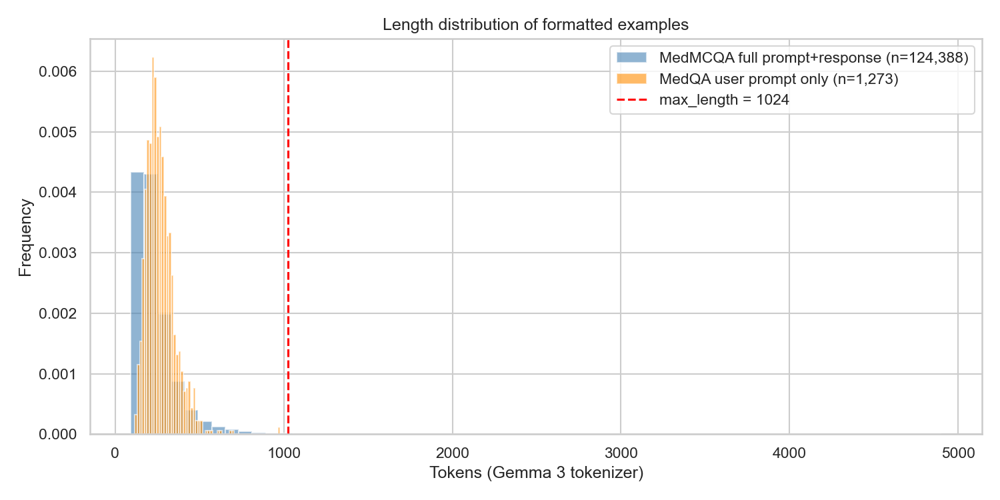
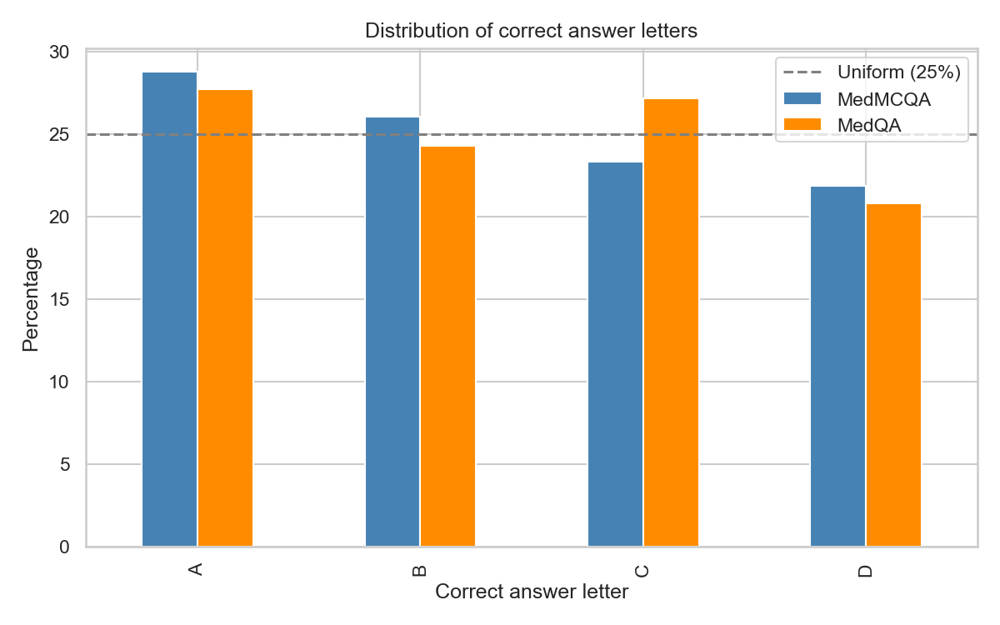
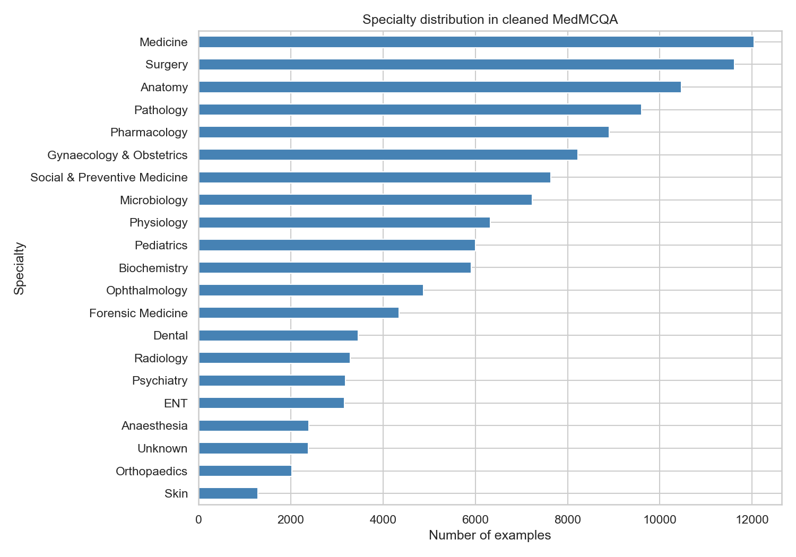
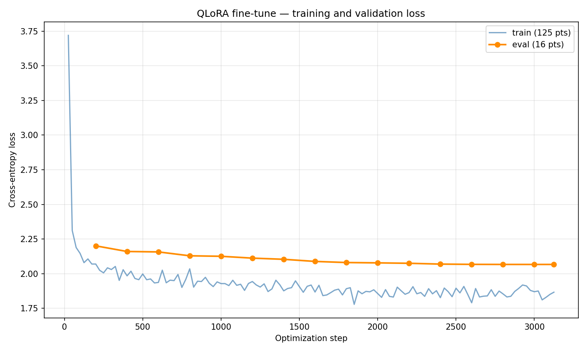

## 1. Introducción y descripción del problema

Los modelos de lenguaje de gran escala (LLMs) modernos atraviesan típicamente cuatro fases de entrenamiento antes de su despliegue. La primera es el preentrenamiento masivo sobre corpus generales —billones de tokens de texto extraído de la web, libros y código—, donde el modelo aprende lenguaje y conocimiento del mundo. La segunda, opcional, es el preentrenamiento continuado sobre un corpus de dominio específico (literatura médica, papers científicos, notas clínicas), donde el vocabulario y los patrones del modelo se sesgan hacia el área de interés. La tercera es el ajuste mediante instrucciones supervisadas, donde el modelo aprende a seguir consignas y a producir respuestas útiles a partir de ejemplos curados de pares pregunta-respuesta. La cuarta es el alineamiento por preferencias humanas o sintéticas —implementado mediante técnicas como RLHF—, donde el modelo refina su comportamiento para responder de manera útil, honesta y segura. El conjunto de las fases tres y cuatro suele agruparse bajo el término post-training.

La adaptación de un LLM a un dominio especializado como la medicina típicamente combina las fases segunda y tercera, manteniendo el alineamiento de la cuarta heredado del modelo base. Esa combinación, sin embargo, conlleva costos computacionales del orden de decenas o cientos de miles de dólares en infraestructura especializada — TPU pods, clusters multi-GPU, semanas de entrenamiento — recursos disponibles únicamente para laboratorios industriales como Google, OpenAI o Anthropic. Esa realidad económica concentra la capacidad de producir modelos de dominio en un puñado de actores y limita la adaptación reproducible por parte de instituciones académicas, sistemas de salud regionales o equipos independientes.

El presente proyecto explora la siguiente pregunta con implicaciones prácticas directas: ¿en qué medida es posible recuperar el desempeño de un modelo de dominio especializado prescindiendo de la fase de preentrenamiento continuado y aplicando únicamente ajuste fino eficiente en parámetros sobre la fase de instrucciones? Concretamente, se toma como modelo base Gemma-3-4B-it, un LLM de propósito general ya pasado por preentrenamiento e instrucciones genéricas por parte de Google, y se compara contra MedGemma-4B-it, un modelo construido por Google sobre exactamente la misma base mediante el pipeline industrial completo (preentrenamiento continuado sobre corpus médico de gran escala más ajuste por instrucciones de dominio). La adaptación se realiza mediante una técnica de fine-tuning eficiente que opera únicamente sobre la fase final del pipeline que es instrucciones de dominio, manteniendo el costo computacional dentro del rango de una GPU de consumidor.

El dominio de aplicación es QA médico tipo examen, formulado como preguntas con respuestas de opción múltiple y además con razonamiento explícito. El modelo recibe una viñeta clínica con un caso de paciente y un conjunto de opciones cerradas, y debe generar una cadena de razonamiento textual (análisis del cuadro clínico, descarte de diferenciales) seguida de la opción correcta. 

La tarea es generativa: el output del modelo es texto libre producido token a token, no una clasificación cerrada sobre cuatro o cinco etiquetas. La cadena de razonamiento se evalúa cualitativamente, mientras que la opción final permite cuantificar desempeño mediante una métrica objetiva.

Este dominio es apropiado para evaluar adaptación al dominio en LLMs ya que exige conocimiento factual extenso —anatomía, fisiopatología, farmacología, guías clínicas— combinado con razonamiento estructurado, lo que pone a prueba simultáneamente la memoria del modelo y sus capacidades de inferencia. Además, las viñetas clínicas reproducen fielmente el tipo de razonamiento que ejerce un profesional médico en formación, dotando al benchmark de validez de constructo respecto a la práctica real.

La utilidad del trabajo en un plano práctico es demostrar una vía accesible para adaptar modelos de lenguaje al dominio médico sin requerir infraestructura industrial. Esto es directamente relevante para sistemas de salud regionales, instituciones académicas, equipos de investigación clínica y desarrolladores independientes que necesitan modelos especializados pero carecen del presupuesto de cómputo de un laboratorio puntero. La diferencia entre "es posible únicamente con acceso a TPU pods" y "es posible en una GPU de consumidor durante una sesión de entrenamiento" es la diferencia entre una capacidad concentrada en pocos actores y una capacidad efectivamente distribuida y reproducible.

En el plano metodológico, el experimento aporta evidencia empírica sobre la contribución específica de cada fase del pipeline de adaptación al dominio. Al comparar el modelo resultante contra MedGemma — que comparte modelo base pero recibió preentrenamiento continuado industrial — y contra el modelo base sin adaptar, se aísla y cuantifica cuánto del beneficio total de la adaptación al dominio puede capturarse o rescatarse mediante ajuste eficiente en la fase de instrucciones. Esa cuantificación tiene valor más allá del proyecto puntual: ofrece una referencia para futuras decisiones de costo-beneficio en otros dominios donde la pregunta "¿conviene invertir en preentrenamiento continuado o basta con ajuste por instrucciones?" se plantea de forma análoga.

Lo que hace al problema interesante es el reto e impacto en la adaptación de un dominio en donde la trazabilidad de un razonamiento explícito es indispensable para la confianza profesional, así como la pugna entre modelos generalistas adaptados con técnicas ligeras y modelos especialistas entrenados extensamente desde fases tempranas. Cuantificar hasta dónde llega la adaptación eficiente y dónde permanece la brecha respecto al preentrenamiento especializado contribuye a un debate técnico y económico dentro del campo.

# 2. Objetivos

## 2.1 Objetivo general

Cuantificar empíricamente en qué medida un fine-tune eficiente en parámetros (QLoRA) aplicado sobre Gemma-3-4B-it permite recuperar el desempeño de MedGemma-4B-it en tareas de QA médico con razonamiento explícito, prescindiendo de la fase de preentrenamiento continuado a escala industrial y operando dentro del presupuesto computacional de una GPU de consumidor.

## 2.2 Objetivos específicos

1. **Implementar el pipeline de adaptación**: aplicar QLoRA fine-tuning sobre Gemma-3-4B-it usando MedMCQA como corpus de entrenamiento, aprovechando su campo de explicación nativa como señal de cadena de razonamiento.

2. **Evaluar el desempeño in-distribution**: comparar el modelo resultante con dos referencias —Gemma-3-4B-it sin adaptar y MedGemma-4B-it— sobre MedMCQA test, bajo protocolo idéntico para los tres.

3. **Medir transferencia entre estilos de examen médico**: evaluar los tres modelos sobre MedQA-USMLE-4options test, un conjunto del examen estadounidense USMLE que el modelo no vio durante el entrenamiento, para verificar si la adaptación generaliza más allá del estilo del corpus de entrenamiento.

4. **Cuantificar la fracción de la brecha recuperada**: reportar qué porcentaje de la diferencia de desempeño entre Gemma-3-4B-it y MedGemma-4B-it logra cerrar el fine-tune QLoRA, respondiendo directamente a la pregunta central del proyecto.

5. **Realizar análisis cualitativo del razonamiento generado**: inspeccionar muestras de cadenas de razonamiento producidas por cada modelo para identificar tipos de error como alucinaciones de entidades médicas, fallos de razonamiento clínico y errores de formato.

## 3. Diseño de Arquitectura

## 3.1 Modelo base

El modelo base elegido es **Gemma-3-4B-it**, una variante instruction-tuned de la familia Gemma 3 de Google, con aproximadamente 4 mil millones de parámetros. La versión "-it" indica que ya pasó por instruction tuning y alineamiento generales por parte de Google, por lo que es capaz de seguir instrucciones desde el primer prompt con una ventana de contexto de hasta 128k tokens.

Tres razones soportan esta elección:

**(1) Permite una comparación limpia con MedGemma.** MedGemma-4B-it fue construido por Google a partir de Gemma-3-4B-it, añadiendo preentrenamiento continuado sobre corpus médico. Al partir también de Gemma-3-4B-it, las diferencias observadas entre nuestro modelo y MedGemma se atribuyen exclusivamente al método de adaptación de dominio. Cualquier otro modelo base (Llama, Qwen, Mistral) introduce variables confundidas — distinto tokenizador, distinto corpus de preentrenamiento, distinto tamaño — que estarían fuera de la comparación dado el alcance del presente trabajo.

**(2) Limitaciones sobre hardware disponible.** Un modelo de 4B parámetros, cuantizado a 4 bits, junto los adaptadores entrenables y los gradientes caben dentro de una GPU de consumidor. Modelos más grandes (8B, 27B) requieren hardware industrial; modelos más pequeños (1B-2B) tienen capacidad insuficiente para razonamiento clínico.

**(3) Capacidad multilingüe nativa.** Gemma 3 fue preentrenado sobre un corpus que incluye texto en más de 140 idiomas. Esto permite que el modelo, tras un fine-tune en inglés, conserve la capacidad de operar sobre preguntas médicas en otros idiomas (como el español), sin colapso del idioma y habilitando el eje de evaluación translingüe.

## 3.2 Por qué la arquitectura Transformer es adecuada

Gemma-3-4B-it es un *transformer decoder-only autoregresivo*, la familia arquitectónica que domina actualmente la generación de texto (GPT, Claude, Llama, Gemma, etc.). Conviene revisar por qué esta arquitectura es particularmente apta para la tarea.

### Atención: el corazón del modelo

El componente central del Transformer es el *mecanismo de atención*. En cada capa, para cada posición de la secuencia, el modelo calcula qué tan relevantes son las posiciones anteriores y combina sus representaciones de forma ponderada. En términos prácticos: cuando el modelo va a predecir el siguiente token, tiene acceso completo y selectivo a todo lo dicho antes.

Esto es exactamente lo que se necesita para razonamiento clínico sobre viñetas largas: un caso puede tener un dato crítico (por ejemplo, "elevación del ST en II, III, aVF") al inicio de la viñeta y la pregunta clave varios cientos de tokens después. La atención permite "regresar" a ese dato con precisión cuando es necesario, capacidad ausente en arquitecturas recurrentes anteriores (LSTM, GRU).

Gemma 3 usa una variante eficiente llamada *Grouped-Query Attention (GQA)*, que reduce el consumo de memoria durante la generación sin pérdida significativa de calidad — útil cuando se generan cadenas de razonamiento extensas.

### Otros componentes

Otros componentes adecuados dentro de la arquitectura seleccionada:

- **RoPE (Rotary Position Embeddings)** para codificar la posición de cada token de forma que el modelo entienda el orden secuencial.
- **GeGLU**, una función de activación con compuerta usada en el MLP de cada bloque, que da más capacidad expresiva que activaciones simples como ReLU.
- **RMSNorm** para estabilizar el entrenamiento, una variante computacionalmente barata de la normalización tradicional.

### Capacidad generativa y espacio latente

El modelo termina con una proyección lineal sobre el vocabulario completo del tokenizador (~256Ki tokens en Gemma 3), produciendo logits que se convierten en una distribución de probabilidad sobre el siguiente token mediante softmax. La generación es autorregresiva: en cada paso se muestrea (según la temperatura, temperatura de cero para selección greedy) un token, se concatena al contexto y se repite.

Las representaciones ocultas del modelo constituyen un espacio latente. Este espacio fue moldeado durante el preentrenamiento masivo para codificar relaciones semánticas, sintácticas, factuales y multilingües del corpus de entrenamiento. Es en este espacio donde residirá el conocimiento médico latente del modelo: las asociaciones entre síntomas y diagnósticos, los mecanismos farmacológicos, los patrones de razonamiento clínico observados en los textos de preentrenamiento. El fine-tuning de dominio actúa precisamente sobre este espacio, reorganizando localmente las regiones relevantes sin reaprender la estructura general del lenguaje. Es por esta misma razón que el conocimiento aprendido en inglés puede transferirse a otros idiomas, donde el conocimiento sin importar el idioma se proyecta a regiones cercanas del mismo espacio conceptual.

## 3.3 Configuración del fine-tuning eficiente: QLoRA

Sobre el modelo base se aplica **_QLoRA_** (Dettmers et al. 2023), un método de fine-tuning eficiente en parámetros que combina dos técnicas independientes:

### Cuantización del modelo base a 4 bits

Los pesos del modelo base se almacenan en formato *NF4 (4-bit NormalFloat)*, una codificación de precisión reducida diseñada específicamente para distribuciones de pesos cercanas a la normal estándar (la distribución empírica de pesos de un transformer preentrenado). Cada peso original en bf16 (16 bits) se mapea al cuantil más cercano de una grilla de 16 valores derivada de la distribución normal. Adicionalmente se aplica doble cuantización: las constantes de escala de la cuantización se cuantizan a su vez, ahorrando ~0.4 bits por parámetro.

Para el forward pass, los pesos cuantizados se descomprimen sobre la marcha al formato de cómputo de adaptadores (Compute Dtype) para ejecutar las operaciones matriciales.

### Adaptadores LoRA

Los pesos cuantizados del modelo base se mantienen congelados durante todo el entrenamiento. Sobre las matrices de proyección lineal seleccionadas se inserta una descomposición de bajo rango: para una matriz original $W \in \mathbb{R}^{d_{\text{out}} \times d_{\text{in}}}$, se añaden dos matrices $A \in \mathbb{R}^{r \times d_{\text{in}}}$ y $B \in \mathbb{R}^{d_{\text{out}} \times r}$ con $r \ll \min(d_{\text{in}}, d_{\text{out}})$. La salida modificada se calcula como:

$$h = Wx + \frac{\alpha}{r} \cdot BAx$$

Solo $A$ y $B$ son entrenables y están en bf16. El producto $BA$ representa una actualización de bajo rango al peso original, suficiente para capturar la adaptación de dominio sin necesidad de modificar todos los parámetros.

### Configuración propuesta para este proyecto

| Hiperparámetro | Valor | Justificación |
|---|---|---|
| Rango LoRA (`r`) | 16 | Punto medio en el rango de literatura (8–64); 16 ofrece capacidad suficiente para adaptación de dominio sin sobreparametrizar |
| Alpha (`α`) | 32 | Convención estándar `α = 2r` que escala las actualizaciones LoRA proporcionalmente al rango |
| Dropout LoRA | 0.05 | Regularización suave; la literatura reporta poca sensibilidad a este valor en el rango 0.0–0.1 |
| Cuantización | NF4 + double quant | Configuración recomendada por el paper original de QLoRA |
| Cómputo de adaptadores | bf16 | Coincide con la precisión nativa de Gemma 3 en TPU/GPU modernas |
| Módulos objetivo | `q_proj`, `k_proj`, `v_proj`, `o_proj`, `gate_proj`, `up_proj`, `down_proj` | Aplicar LoRA a la atención completa (Q,K,V,O) y al MLP completo (gate, up, down) maximiza la cobertura sin entrenar embeddings ni LM head |

Aplicar LoRA a los siete módulos objetivo es la práctica actual recomendada por trabajos como el reporte oficial de PEFT y el paper de QLoRA (Dettmers et al. 2023).

---

## 3.4 Entradas, salidas y flujo del sistema

### Tokenizador

Gemma 3 utiliza un tokenizador *SentencePiece* con vocabulario de aproximadamente 256Ki tokens, entrenado sobre el corpus multilingüe de preentrenamiento. Es idéntico al tokenizador de MedGemma, lo que garantiza que los dos modelos comparados procesan la entrada con el mismo nivel de granularidad léxica.

### Chat template

Gemma 3 espera un formato de conversación delimitado por tokens especiales de turno:

```text
<start_of_turn>user
{contenido del mensaje del usuario}<end_of_turn>

<start_of_turn>model
{respuesta generada del modelo}
<end_of_turn>
```

Este es el formato que el modelo aprendió a seguir durante su instruction tuning original y el que se va a utilizar.

### Entrada del modelo

Para una pregunta MCQA, la entrada se construye así:

```text
<start_of_turn>user
You are a medical expert. Answer the following multiple-choice question
by reasoning step by step, then giving your final answer as a single letter.

Question: A 65-year-old man presents with crushing substernal chest pain
radiating to the left arm, diaphoresis, and nausea. ECG shows ST-segment
elevation in leads II, III, and aVF.

A) Pericarditis
B) Inferior wall myocardial infarction
C) Aortic dissection
D) Pulmonary embolism

Reason step by step, then provide your answer in the format "Answer: <letter>".
<end_of_turn>
```

Este texto se tokeniza, produciendo una secuencia de identificadores enteros que ingresan al modelo. La longitud típica está entre 200 y 500 tokens.

### Salida del modelo

A partir del último token de la entrada, el modelo genera autorregresivamente: en cada paso produce una distribución de probabilidad sobre los 256Ki tokens del vocabulario, se selecciona el token con la mayor probabilidad mediante *Greedy Decoding* (garantizando así determinismo y reproducibilidad, comportamiento requerido en evaluación médica), se añade al contexto, y se repite hasta encontrar el token `<end_of_turn>` o alcanzar `max_new_tokens`. La salida típica:

```text
<start_of_turn>model
Reasoning: Leads II, III, and aVF correspond to the inferior wall of the heart.
ST-segment elevation in these leads, combined with the clinical picture of
crushing chest pain, diaphoresis, and nausea, is the classic presentation of
an acute inferior wall myocardial infarction. Pericarditis would show diffuse
ST elevation across multiple leads. Aortic dissection typically presents with
tearing pain radiating to the back. Pulmonary embolism would show right heart
strain (S1Q3T3), not inferior ST elevation.

Answer: B
<end_of_turn>
```

### Flujo end-to-end del sistema

```text
┌───────────────────────────────────────────────────────────────┐
│  1. Pregunta cruda del dataset (MedQA / MedMCQA / HEAD-QA)    │
│     {question, options, correct_letter}                       │
└──────────────────────────────┬────────────────────────────────┘
                               │
                               ▼
┌───────────────────────────────────────────────────────────────┐
│  2. Construcción del prompt aplicando el chat template        │
│     de Gemma con system instruction + question + options      │
└──────────────────────────────┬────────────────────────────────┘
                               │
                               ▼
┌───────────────────────────────────────────────────────────────┐
│  3. Tokenización: SentencePiece → secuencia de input_ids      │
└──────────────────────────────┬────────────────────────────────┘
                               │
                               ▼
┌───────────────────────────────────────────────────────────────┐
│  4. Forward pass autorregresivo                               │
│     ┌─────────────────────────────────────────────────────┐   │
│     │  Embedding lookup                                   │   │
│     │       │                                             │   │
│     │       ▼                                             │   │
│     │  N capas transformer con:                           │   │
│     │    - GQA + RoPE                                     │   │
│     │    - GeGLU MLP                                      │   │
│     │    - RMSNorm                                        │   │
│     │    - LoRA adapters en bf16 (entrenables)            │   │
│     │    - Pesos base en NF4 4-bit (congelados)           │   │
│     │       │                                             │   │
│     │       ▼                                             │   │
│     │  LM head → logits sobre vocabulario                 │   │
│     │       │                                             │   │
│     │       ▼                                             │   │
│     │  Greedy Decoding → token siguiente                  │   │
│     └─────────────────────────────────────────────────────┘   │
│     Predecir siguiente token (autoregresivo) hasta            │    │       <end_of_turn> o max_new_tokens                          │
└──────────────────────────────┬────────────────────────────────┘
                               │
                               ▼
┌───────────────────────────────────────────────────────────────┐
│  5. Decodificación de tokens → texto                          │
│     "Reasoning: ... Answer: B"                                │
└──────────────────────────────┬────────────────────────────────┘
                               │
                               ▼
┌───────────────────────────────────────────────────────────────┐
│  6. Extracción de respuesta vía regex sobre patrones          │
│     "Answer: ([A-D])" → letra predicha                        │
└───────────────────────────────────────────────────────────────┘
        

```

## 3.5 Alternativas consideradas y descartadas

| Alternativa | Razón de descarte |
|---|---|
| **Full fine-tuning de Gemma-3-4B** | Requiere >30 GB de VRAM solo para gradientes y estados del optimizador. Infactible en hardware disponible. |
| **LoRA sin cuantización (base en bf16)** | Solo el modelo base en bf16 podría ocupar 8 GB; sumando activaciones y demás, no es factible. |
| **Modelo base Llama-3.1-8B u otro de familia distinta** | Rompe la comparación causal contra MedGemma; las diferencias observadas no podrían ser atribuibles a la adaptación de dominio sino al modelo base. |
| **Modelo más pequeño (Gemma-3-1B)** | Capacidad insuficiente para razonamiento clínico complejo según evidencia consistente en la literatura. |
| **Modelo más grande (Gemma-3-27B)** | No cabe en hardware disponible ni con QLoRA agresivo. Requeriría hardware industrial. |

# 4. Estrategia de Datos

## 4.1 Datasets utilizados

El corpus de datos del proyecto se compone de dos datasets con roles diferenciados: uno para entrenamiento y uno exclusivamente para evaluación. Esta separación responde al objetivo 3 establecido en la sección anterior: medir transferencia entre estilos de examen médico (MedMCQA → MedQA).

| Dataset | Idioma | Origen | Cita | Licencia | Rol |
|---|---|---|---|---|---|
| **MedMCQA** | Inglés | Examen de admisión médica indio (AIIMS, NEET-PG) | Pal et al., CHIL 2022 | MIT | Entrenamiento + validación + evaluación in-distribution |
| **MedQA-USMLE-4options** | Inglés | Examen USMLE (Estados Unidos) | Jin et al., arXiv 2020 | MIT | Evaluación out-of-distribution (solo test) |

### MedMCQA

Dataset de preguntas tipo opción múltiple del examen de admisión a residencia médica en India. Contiene preguntas de 21 especialidades médicas (anatomía, fisiología, farmacología, patología, microbiología, medicina interna, cirugía, ginecología, pediatría, etc.) con cuatro opciones de respuesta. Una fracción mayoritaria de las preguntas incluye un campo `explanation` con la justificación de la respuesta correcta extraída del libro de texto de referencia, lo que permite usarlo como señal de cadena de razonamiento (CoT) sin necesidad de generación sintética.

**Razones de elección como dataset de entrenamiento:**
1. Es uno de los datasets MCQA médico más grande disponible públicamente, y es utilizado como benchmark de referencia citado en el reporte técnido de MedGemma.
2. Incluye explicaciones nativas escritas por humanos, evitando depender de un teacher LLM externo para generar CoT.
3. Cobertura amplia y balanceada de especialidades.
4. Licencia MIT, permite uso académico sin restricciones.

### MedQA-USMLE-4options

Dataset de preguntas tipo USMLE, el examen de licenciatura médica estadounidense. La variante "4-options" reduce las preguntas originales de 5 a 4 opciones, alineando el formato con MedMCQA y permitiendo evaluar con un parser unificado.

**Razones de elección como evaluación out-of-distribution y no como entrenamiento:**
1. Mantiene su rol como benchmark de referencia citado en el reporte técnico de MedGemma.
2. Permite medir transferencia entre estilos de examen: las viñetas USMLE tienden a ser más largas y con razonamiento clínico más elaborado que las preguntas indias de admisión.
3. Su tamaño compacto cabe íntegro dentro del cap de evaluación.

A diferencia de MedMCQA, el dataset original de MedQA no provee desglose por especialidad médica como campo estructurado. Por consiguiente, la evaluación sobre MedQA se realiza únicamente como accuracy global sobre la respuesta correcta, sin desglose por especialidad. El análisis por categoría se reporta exclusivamente sobre MedMCQA.

---

## 4.2 Preprocesamiento

El preprocesamiento se aplica a los datasets completos antes de definir cualquier subconjunto del experimento. El objetivo es producir, para cada dataset, un corpus limpio, libre de duplicados internos, libre de leakage cruzado y sin tokens fuera de vocabulario. Los subconjuntos de entrenamiento y evaluación se construyen posteriormente en §4.5 sobre el resultado de este preprocesamiento.

Las operaciones se ejecutan en el orden: filtrado → deduplicación → verificación de leakage → sanity checks. El resumen consolidado se reporta en §4.2.5.

### 4.2.1 Filtrado de calidad

Los siguientes filtros se aplican a los datasets completos:

| Filtro | Acción | Motivo | Aplica a MedMCQA | Aplica a MedQA |
|---|---|---|---|---|
| Pregunta o opciones vacías/null | Descartar | Datos malformados | ✓ | ✓ |
| Campo de respuesta correcta fuera del rango {0,1,2,3} | Descartar | Etiqueta corrupta | ✓ | ✓ |
| Pregunta con menos de 5 tokens | Descartar | Probable error de extracción | ✓ | ✓ |
| Sin campo `exp` (sin explicación) | Descartar | Sin señal de CoT, inconsistente con el resto del corpus de entrenamiento | ✓ | ✗ |
| Idioma detectado distinto a inglés (vía `langdetect`) | Descartar | Posible contaminación de otros idiomas | ✓ | ✓ |

El campo `exp` aplica únicamente a MedMCQA porque solo se usa para entrenamiento, donde la explicación es requerida como señal de CoT. MedQA se usa exclusivamente para evaluación (la cadena de razonamiento la genera el modelo en inferencia, no la consume del dataset), por lo que la ausencia de `exp` en MedQA es esperada y no constituye motivo de descarte.

### 4.2.2 Deduplicación

Se eliminan los ejemplos con preguntas exactamente duplicadas dentro de cada dataset, conservando una sola copia de cada pregunta única. La detección se realiza mediante hash MD5 del campo `question` normalizado (lowercased, sin puntuación, espacios colapsados). La deduplicación se aplica una vez sobre la totalidad de cada dataset (MedMCQA y MedQA test) tras el filtrado de §4.2.1.

### 4.2.3 Verificación de no-leakage

Tras la deduplicación interna, se verifica que no haya overlap entre los dos datasets utilizados en el experimento:

- **MedMCQA ∩ MedQA test**: comparación de hashes entre todas las preguntas limpias de MedMCQA y todas las preguntas limpias de MedQA test, para detectar duplicados cruzados (los datasets provienen de exámenes distintos pero podrían existir preguntas reusadas de bancos comunes).

Cualquier overlap encontrado se elimina del lado de MedQA (no de MedMCQA), priorizando la integridad del conjunto de evaluación.

### 4.2.4 Sanity checks automatizados

Sobre los corpus ya filtrados, deduplicados y libres de leakage se ejecutan controles automatizados que informan las decisiones de §4.4 (formateo) y verifican la salud del corpus.

#### Distribución de longitudes (tokens)

Se computa el histograma de longitudes en tokens (post-tokenización con el tokenizador de Gemma 3) de los ejemplos formateados completos. Esta distribución informa la elección de `max_length` en §4.4.4.

> 
> *Figura 4.1 — Distribución de longitudes (tokens) de ejemplos formateados en MedMCQA y MedQA tras filtrado.*

| Percentil | MedMCQA (tokens) | MedQA (tokens) |
|---|---|---|
| p50 (mediana) | _201_ | _256_ |
| p90 | _380_ | _376_ |
| p95 | _477_ | _425_ |
| p99 | _768_ | _503_ |
| máximo | _4,901_ | _979_ |

#### Distribución de letras correctas

Verifica que la distribución A/B/C/D no esté sesgada. 

> 
> *Figura 4.2 — Distribución de letras correctas en MedMCQA y MedQA limpios.*

#### Distribución de especialidades

Se reporta la frecuencia de cada una de las 21 especialidades médicas en el corpus limpio de MedMCQA. Este desglose informa el muestreo estratificado en §4.5 y el análisis de accuracy por especialidad en Evaluación. MedQA no dispone de esta información (ver §4.1) y por tanto no aparece en este desglose.

> 
> *Figura 4.3 — Distribución de las 21 especialidades en MedMCQA limpio.*

#### Tokens fuera de vocabulario

Se verifica que el tokenizador de Gemma 3 no produce tokens desconocidos (`<unk>`) sobre los corpus. Dado que Gemma 3 usa un vocabulario SentencePiece de ~256k tokens entrenado sobre corpus multilingüe masivo, la tasa esperada de OOV es efectivamente cero. En caso de corrupción confirmada, se descartan.

| Métrica | MedMCQA | MedQA |
|---|---|---|
| Tokens totales en el corpus | _29,579,163_ | _342,494_ |
| Tokens `<unk>` detectados | _0_ | _0_ |
| Porcentaje de OOV | _0%_ | _0%_ |
| Ejemplos descartados por corrupción | _0_ | _0_ |

### 4.2.5 Resumen del corpus consolidado

Tabla consolidada que reporta la reducción del corpus a través de las operaciones del preprocesamiento (filtrado, deduplicación, leakage, OOV).

| Etapa | MedMCQA | MedQA `test` |
|---|---|---|
| Corpus crudo | _187,005_ | _1,273_ |
| Tras filtrado de calidad | _145,206_ | _1,273_ |
| Tras deduplicación | _124,388_ | _1,273_ |
| Tras eliminación de leakage cruzado | _124,388_ | _1,273_ |
| Tras eliminación de OOV (si aplica) | _124,388_ | _1,273_ |
| **Corpus final** | **_124,388_** | **_1,273_** |
| Pérdida total respecto al crudo (%) | _33.48%_ | _0.0%_ |

 Para MedMCQA el corpus combina las particiones `train` y `validation` provistas originalmente por los autores del dataset; las etiquetas de partición se preservan internamente en cada ejemplo y se utilizan en §4.5 para construir los subconjuntos del experimento.

---

## 4.3 Estadísticas descriptivas

Las estadísticas siguientes describen el corpus tras el preprocesamiento de §4.2. Son las cifras que efectivamente alimentan los splits de entrenamiento y evaluación.

| Estadística | MedMCQA (post-preprocesamiento) | MedQA-4opt (test post-preprocesamiento) |
|---|---|---|
| Preguntas totales | _124,388_ | _1,273_ |
| Longitud media de la pregunta (tokens) | _19.11_ | _174.03_ |
| Longitud media de cada opción (tokens) | _4.29_ | _5.66_ |
| Longitud media de la explicación (tokens) | _120.01_ | N/A |
| Cobertura de categorías | 21 especialidades médicas | No disponible |
| Balance de letras correctas (A/B/C/D) | _28.79%, 26.05%, 23.33%, 21.84%_ | _27.73%, 24.27%, 27.18%, 20.81%_ |

**Notas:**

- Las longitudes se reportan en tokens del tokenizador SentencePiece de Gemma 3, no en palabras, para consistencia con la unidad usada durante entrenamiento e inferencia.
- "Post-preprocesamiento" significa después de filtrado, deduplicación, eliminación de leakage y eliminación de OOV (§4.2). Es el corpus efectivo del que se sortean los splits en §4.5.
- Sobre el balance de opciones correctas: El ligero desbalance observado en la distribución de respuestas (con una leve preponderancia hacia la opción 'A' y menor frecuencia en la 'D') no representa un problema metodológico crítico. Dado que el fine-tuning penaliza la entropía cruzada de toda la cadena de razonamiento (CoT) y no solo la clasificación final, el modelo es forzado a aprender la inferencia clínica subyacente en lugar de explotar heurísticas o sesgos estadísticos de posición

---

## 4.4 Formateo y tokenización

Una vez producido el corpus limpio (post-§4.2), cada ejemplo se transforma en un par prompt-respuesta listo para entrenar. Esta sección define las decisiones de formato y tokenización que constituyen el "lado del input/output" del modelo.

### 4.4.1 Construcción del prompt (turno del usuario)

```text
<bos><start_of_turn>user
You are a medical expert. Answer the following multiple-choice question
by reasoning step by step, then giving your final answer as a single letter.

Question: {question}

A) {opa}
B) {opb}
C) {opc}
D) {opd}

Reason step by step, then provide your answer in the format "Answer: <letter>".
<end_of_turn>
```

### 4.4.2 Construcción de la respuesta esperada (turno del modelo)

```text
<start_of_turn>model
Reasoning: {exp}

Answer: {letter_from_cop}
<end_of_turn>
```

Donde `{letter_from_cop}` se obtiene mapeando el índice numérico de la respuesta correcta (0,1,2,3) a la letra correspondiente (A,B,C,D).

### 4.4.3 Decisiones de formateo

- **Instrucción inline en el turno de usuario**: la consigna se incluye en el turno del usuario en lugar de un turno de sistema separado, porque Gemma no tiene un rol "system" formal en su chat template.
- **Formato de respuesta uniforme**: todos los ejemplos terminan con la línea `Answer: <letter>` para facilitar el parseo durante evaluación con un único regex.
- **Solo letras como identificador de opción**: no se usa numeración adicional, alineando con el formato de MedQA.

### 4.4.4 Política de truncamiento

La distribución de longitudes reportada en §4.2.4 informa el techo de truncamiento. Con un percentil 95 medido en _477_ tokens y un percentil 99 en _768_ tokens sobre el corpus de entrenamiento (MedMCQA), se establece:

- **`max_length = 1024` tokens**: techo aplicado durante la tokenización.
- **Estrategia**: `truncation="longest_first"`, aplicado preferentemente a la explicación (no a la pregunta ni a las opciones), porque la pregunta y las opciones son contenido crítico que el modelo debe ver íntegro para aprender la asociación correcta.
- **Ejemplos que excederían 1024 tokens**: se truncan según la política anterior (no se descartan), preservando pregunta + opciones + respuesta final.

**Justificación de 1024 como techo:**
- Cubre el ~99% de los ejemplos sin truncamiento después de realizar el análisis exploratorio.
- Es potencia de 2, lo que aprovecha alineamiento con kernels GPU.
- Subir a 2048 doblaría el costo computacional de la atención sin beneficio para la inmensa mayoría de los ejemplos.

**Tasa de truncamiento aplicada:**

| Métrica | Valor |
|---|---|
| Ejemplos truncados | _435_ |
| Porcentaje del corpus | _0.35%_ |

### 4.4.5 Padding

Las secuencias formateadas tienen longitud variable. Durante el entrenamiento se agrupan en batches, lo que obliga a igualar longitudes dentro de cada batch mediante tokens de relleno (*padding*). La política aplicada es padding dinámico al máximo de cada batch en lugar de padding estático al techo global `max_length = 1024`. La razón es eficiencia: cuando un batch contiene secuencias substancialmente más cortas que el techo, el padding estático desperdicia cómputo en posiciones que no aportan señal de aprendizaje, mientras que el padding dinámico solo rellena hasta lo necesario para alinear las secuencias del batch en cuestión.

Esta operación es propia del *runtime* de entrenamiento, no del preprocesamiento: el corpus que sale de la presente sección contiene secuencias sin padding. La implementación concreta del *data collator* responsable del padding, junto con la configuración fina se detalla en §5.

### 4.4.6 Etiquetado de labels (`-100`)

Durante el entrenamiento, la pérdida de cross-entropy debe calcularse únicamente sobre los tokens de la respuesta del modelo —cadena de razonamiento, letra final y token de fin de turno—, no sobre los tokens del prompt del usuario. La razón conceptual es que el prompt es contexto fijo dado al modelo; obligarlo a "predecir" su propio prompt no aporta señal útil y diluiría el gradiente entre miles de tokens de pregunta y opciones. Para lograr ese filtrado, los tokens del prompt se etiquetan con el valor especial `-100`, que la implementación de cross-entropy de PyTorch interpreta como "ignorar en el cálculo del loss".

Esta mecánica es propia del _loop_ de entrenamiento. El corpus que sale del preprocesamiento contiene los pares prompt-respuesta sin etiquetado de loss; el etiquetado con `-100` se aplica al construir cada batch en tiempo de entrenamiento detallado en §5.

### 4.4.7 Inspección manual

Se revisa una muestra aleatoria de 10 ejemplos del corpus formateado (post-tokenización, decodificados de vuelta a texto) para verificar:

- Coherencia entre pregunta, opciones y respuesta correcta.
- Calidad de la explicación como cadena de razonamiento.
- Formato consistente del prompt y la respuesta.
- Ausencia de artefactos de extracción (HTML residual, caracteres mal codificados).
- Aplicación correcta del chat template y tokens especiales.

La inspección se realiza en `notebooks/01_data_exploration.ipynb`. Los hallazgos cualitativos no se incluyen aquí — el reporte simplemente confirma que la inspección fue ejecutada y no se detectaron problemas mayores.

---

## 4.5 Splits del experimento

A partir del corpus limpio producido en §4.2, se construyen los subconjuntos definitivos que se usan para monitoreo durante el entrenamiento y validación, y la evaluación final. La construcción se realiza por muestreo estratificado sobre las particiones originales del dataset (`train`, `validation`, `test`).

### Pools disponibles tras preprocesamiento

| Pool | Origen | Tamaño disponible |
|---|---|---|
| MedMCQA `train` limpio | partición original `train` de MedMCQA tras §4.2 | _122,315_ |
| MedMCQA `validation` limpio | partición original `validation` de MedMCQA tras §4.2 | _2,073_ |
| MedQA `test` limpio | partición `test` de MedQA tras §4.2 | _1,273_ |

### Regla de muestreo

Para cada subconjunto se define un objetivo de tamaño. La regla aplicada es:

- Si el pool disponible excede el objetivo: se realiza muestreo estratificado al tamaño objetivo, conservando la distribución original de especialidades (en MedMCQA) o sin estratificación (en MedQA, que no dispone de etiqueta de categoría).
- Si el pool disponible no alcanza el objetivo: se utilizan todos los ejemplos disponibles, dejando registrado el tamaño efectivo en el reporte.


### Construcción de los subconjuntos

#### Conjunto de entrenamiento

Del pool MedMCQA `train` limpio (_122,315_ ejemplos disponibles) se extrae un subconjunto estratificado por especialidad con objetivo 50,000 ejemplos.

#### Conjunto de validación durante el entrenamiento

Del pool MedMCQA `validation` limpio (_2,073_ ejemplos disponibles) se extrae un primer subconjunto estratificado con objetivo 500 ejemplos, destinado al monitoreo de val accuracy intermedia durante el entrenamiento.

#### Conjunto de evaluación in-distribution

Del mismo pool MedMCQA `validation` limpio, excluyendo los 500 del subconjunto anterior para evitar leakage entre monitoreo y evaluación final, se extrae el segundo subconjunto estratificado de 1,573 ejemplos (_2,073_ - _500_ de validación). Esta es la métrica final in-distribution comparable entre los tres modelos del experimento.

#### Conjunto de evaluación out-of-distribution

Del pool MedQA `test` limpio (_1,273_ ejemplos disponibles) se utilizan todos los ejemplos sin muestreo adicional. 

### Resumen final

| Conjunto  | Tamaño efectivo | Origen | Uso |
|---|---|---|---|
| Entrenamiento  | _50,000_ | MedMCQA `train` limpio, muestreo estratificado | Fine-tuning QLoRA |
| Validación durante entrenamiento | _500_ | MedMCQA `validation` limpio, muestreo estratificado | Eval intermedia (cada N pasos) |
| Evaluación in-distribution | _1,573_ | MedMCQA `validation` limpio, muestreo estratificado disjunto | Métrica final in-distribution |
| Evaluación out-of-distribution | todos los disponibles | _1,273_ | MedQA `test` limpio íntegro | Métrica final out-of-distribution |


# 5. Entrenamiento

Esta sección define el procedimiento de optimización por el cual el adaptador QLoRA se ajusta sobre el modelo base congelado para producir `gemma-3-4b-it-qlora-finetune`. Las decisiones arquitectónicas del adaptador (rango, alfa, dropout, cuantización, módulos objetivo) ya están definidas en §3.3; las decisiones de formato de los ejemplos y máscaras de pérdida en §4.4. La presente sección se restringe al lado de optimización: función de pérdida efectiva, optimizador, schedule de learning rate, composición del batch, duración, monitoreo durante el entrenamiento y selección del checkpoint final.

## 5.1 Función de pérdida

El criterio optimizado es la entropía cruzada token a token sobre las posiciones de respuesta del modelo, excluyendo las posiciones del prompt mediante el etiquetado `-100` definido en §4.4.6. Para una secuencia formateada con respuesta de longitud $|R|$ tokens, la pérdida del ejemplo es:

$$\mathcal{L} = -\frac{1}{|R|} \sum_{t \in R} \log p_\theta(y_t \mid y_{<t},\, x_{\text{prompt}})$$

donde $\theta$ refiere únicamente a los parámetros entrenables (los adaptadores LoRA; la base permanece congelada). El gradiente se calcula sólo sobre los tokens de la cadena de razonamiento más la letra final, no sobre la pregunta ni las opciones; promediar el resto diluiría la señal sin aportar aprendizaje útil.

## 5.2 Parámetros entrenables

Sólo las matrices $A$ y $B$ de los siete módulos LoRA definidos son entrenables; el resto del modelo —pesos del Transformer, embeddings y LM head— permanece congelado en NF4 + doble cuantización durante toda la corrida (todo esto descrito en §3.3). La tabla siguiente reporta el recuento aproximado de parámetros:

| Cantidad | Valor |
|---|---|
| Parámetros totales del modelo base | _TBD_ |
| Parámetros entrenables (adaptadores LoRA) | _TBD_ |
| Fracción entrenable | _TBD_ |

Esta razón —del orden de fracciones de punto porcentual— es lo que hace que el entrenamiento quepa en hardware de consumidor: los estados del optimizador y los gradientes se computan sólo sobre los adaptadores, no sobre los miles de millones de parámetros de la base.

## 5.3 Optimizador y schedule de learning rate

| Hiperparámetro | Valor | Justificación |
|---|---|---|
| Optimizador | `paged_adamw_32bit` | Variante de AdamW que es idéntica a la versión estándar (mantiene los estados del optimizador en precisión completa, fp32), pero incorpora una función dinámica de paginación hacia la RAM del CPU. Es la configuración exacta propuesta en el artículo original de QLoRA (Dettmers et al., 2023). La paginación es operacional: transfiere bloques de memoria al sistema host solo cuando detecta alta presión en la VRAM. De esta forma, logra absorber los picos abruptos de consumo de memoria (frecuentes al procesar secuencias largas o utilizar gradient checkpointing) sin modificar los cálculos matemáticos, garantizando una trayectoria de optimización indistinguible de la de un AdamW convencional |
| Learning rate inicial | `2e-4` | Valor de referencia del paper original de QLoRA (Dettmers et al. 2023). Suficientemente alto para entrenar adaptadores recién inicializados en pocas pasadas; suficientemente bajo para no desestabilizar el bloque cuantizado |
| LR scheduler | `cosine` | Decae el LR suavemente desde el valor inicial hasta cerca de cero al final del entrenamiento, reduciendo oscilación en la fase final cuando la pérdida ya está cerca de su mínimo |
| Warmup ratio | `0.03` | El 3% de los pasos totales se dedica a un calentamiento lineal desde 0 hasta el LR inicial. Estabiliza las primeras actualizaciones sobre adaptadores cuya inicialización aleatoria es incompatible con un LR pleno desde el paso 0 |
| Weight decay | `0.0` | LoRA introduce regularización implícita por construcción (rango bajo + dropout), por esto añadir weight decay en este régimen podría perjudicar la convergencia en lugar de ayudar |
| Max grad norm | `1.0` | Clipping estándar de la norma del gradiente para LLMs. Previene actualizaciones desproporcionadas ante batches con ejemplos atípicamente largos o difíciles |
| Precisión de cómputo | `bf16` | Coincide con el compute dtype declarado en §3.3 para los adaptadores. La base se mantiene congelada bajo NF4 + doble cuantización con descompresión sobre la marcha; los gradientes y los estados de los adaptadores viven en bf16 |

## 5.4 Composición del batch y duración

| Hiperparámetro | Valor |
|---|---|
| `per_device_train_batch_size` | 4 |
| `gradient_accumulation_steps` | 4 |
| Batch efectivo | 16 |
| `max_length` | 1024 (§4.4.4) |
| Padding | dinámico por batch (§4.4.5) |
| Épocas | 1 |
| Pasos de optimización aproximados | ≈ 3,125 (50,000 ejemplos del conjunto de entrenamiento / batch efectivo 16, una época) |

El batch efectivo de 16 balancea dos restricciones: por debajo, la varianza del gradiente aumenta y el cosine schedule pierde estabilidad práctica; por encima, el costo en VRAM de activaciones intermedias y attention durante el forward excede la capacidad de la GPU sin beneficios proporcionales en estabilidad. La descomposición elegida (`per_device=4` × `accum=4`) prioriza la eficiencia de cómputo dentro de ese techo.

## 5.5 Monitoreo durante el entrenamiento y selección del checkpoint

El conjunto de validación durante el entrenamiento es `validation` definido en §4.5. Sobre este conjunto se evalúa la pérdida a una cadencia fija.

### Cadencia de evaluación

| Configuración | Valor |
|---|---|
| `eval_strategy` | `steps` |
| `eval_steps` | 200 (≈ 16 evaluaciones a lo largo de los 3,125 pasos) |
| Métrica monitoreada | pérdida de validación, definida como en §5.1 sobre el conjunto `validation` de §4.5 |

### Selección del checkpoint final

| Configuración | Valor |
|---|---|
| Criterio de selección | mínima pérdida de validación observada a lo largo de la corrida |
| Adapter persistido al final | sólo los pesos LoRA correspondientes al checkpoint seleccionado (`adapter_config.json` + `adapter_model.safetensors`); la base congelada no se persiste, ya que se reconstruye desde su identificador en el Hub |
| Ruta de salida | `artifacts/gemma-3-4b-it-qlora-finetune/adapter/` |

Durante la corrida se mantiene en disco un único checkpoint adicional, el más reciente, exclusivamente para permitir reanudación desde el último punto en caso de interrupción. Una vez finalizada la corrida y seleccionado el mejor checkpoint, los intermedios se eliminan.

## 5.6 Búsqueda de hiperparámetros

No se realiza una búsqueda sistemática (grid o bayesiana) sobre los hiperparámetros descritos en §5.3 y §5.4. La totalidad de las elecciones se adopta de los valores de referencia del paper original de QLoRA y de las prácticas estándar de la librería PEFT.

Esta decisión es consistente con el alcance del proyecto declarado en §1 y §2: el objetivo es cuantificar la fracción de la brecha de adaptación de dominio recuperable mediante un fine-tune eficiente principal, no encontrar la configuración óptima de hiperparámetros para QLoRA en el dominio médico.

## 5.7 Curvas y diagnóstico

Las pérdidas de entrenamiento y validación se registran en cada paso y en cada evaluación, respectivamente. La figura siguiente reporta su evolución a lo largo de la corrida final.

> 
> *Figura 5.1 — Pérdida de entrenamiento (por paso) y de validación (cada `eval_steps = 200`) a lo largo de la corrida única del fine-tune QLoRA. Se completa tras ejecutar el entrenamiento.*


# 6. Evaluación

Esta sección define el protocolo experimental con el que se mide el desempeño de los tres modelos comparados, las métricas reportadas y su definición precisa, el procedimiento de extracción de la respuesta del texto generado y el análisis cualitativo asociado. El protocolo es idéntico para los tres modelos, lo que permite atribuir cualquier diferencia observada únicamente a la adaptación de dominio aplicada y no a artefactos del proceso de evaluación.

## 6.1 Conjuntos de evaluación

Se utilizan dos conjuntos construidos en §4.5, ambos posteriores al preprocesamiento de §4.2 (limpios, deduplicados, sin leakage cruzado):

| Conjunto | Origen | Tamaño | Rol | Desglose por especialidad |
|---|---|---|---|---|
| `test_id` | MedMCQA `validation` (estratificado, disjunto del subconjunto de monitoreo) | _1,573_ | Evaluación in-distribution | Sí (21 especialidades) |
| `test_ood` | MedQA `test` íntegro | _1,273_ | Evaluación out-of-distribution | No |

`test_id` mide desempeño sobre la distribución de la que MedMCQA fue extraído (examen de admisión médica indio); `test_ood` mide transferencia a un estilo de examen distinto (USMLE estadounidense), atendiendo al objetivo específico 3 de §2.2. Ningún ejemplo de `test_id` aparece en el conjunto de entrenamiento (separación garantizada por la disyunción de pools en §4.5) ni de `test_ood` aparece en el corpus de entrenamiento (verificación cruzada de hashes en §4.2.3).

## 6.2 Modelos comparados

Los tres modelos se evalúan bajo protocolo idéntico:

| Identificador | Rol | Origen | Inicialización |
|---|---|---|---|
| `gemma-3-4b-it` | Piso (sin adaptación de dominio) | HuggingFace Hub: `google/gemma-3-4b-it` | Pesos públicos en bf16 |
| `gemma-3-4b-it-qlora-finetune` | Modelo del proyecto | Modelo base + adaptador QLoRA entrenado en §5 | Base congelada en NF4 + adaptador LoRA en bf16 |
| `medgemma-4b-it` | Techo industrial | HuggingFace Hub: `google/medgemma-4b-it` | Pesos públicos en bf16 |

La elección triangula tres puntos sobre el eje de adaptación al dominio: el desempeño del modelo base sin tratamiento alguno, el del modelo del proyecto vía ajuste eficiente sobre la fase de instrucciones, y el del modelo industrial construido sobre la misma base con preentrenamiento continuado de gran escala. Cualquier diferencia entre `gemma-3-4b-it-qlora-finetune` y `medgemma-4b-it` se atribuye exclusivamente a la fase de preentrenamiento continuado, dado que ambos parten del mismo modelo base y son evaluados bajo idéntico protocolo.

## 6.3 Protocolo de inferencia

### 6.3.1 Chat template y prompt

La construcción del prompt sigue el formato definido en §4.4.1: instrucción inline en el turno de usuario, pregunta y opciones formateadas con letras A–D, y solicitud explícita de cadena de razonamiento seguida de la respuesta en el formato `Answer: <letter>`. Para inferencia, el prompt se cierra con `<start_of_turn>model` (vía `add_generation_prompt=True` del chat template del tokenizador) de modo que el modelo continúe en la posición esperada.

### 6.3.2 Parámetros de generación

| Parámetro | Valor | Justificación |
|---|---|---|
| `do_sample` | `False` (greedy) | Determinismo y reproducibilidad. Bajo evaluación médica, dos corridas deben producir el mismo resultado para que las diferencias entre modelos sean atribuibles al modelo y no a la varianza del muestreo. |
| `max_new_tokens` | 512 | De acuerdo con §4.2.4, el percentil 99 cubre hasta 768 tokens y considera `user prompt` + `exp`, por lo que solo para `exp` la cantidad de 512 tokens podría cubrir hasta el percentil 99 con un truncamiento residual esperado situado por debajo del 1%. |
| `temperature` | 1.0 | Inerte bajo decodificación greedy; declarada explícita por compatibilidad con versiones de la librería de generación que requieren un valor presente. |
| `repetition_penalty` | 1.0 | Sin penalización. Si el modelo cae en bucles degenerados, ese modo de falla queda visible en la generación y en la tasa de parseo en lugar de ser ocultado por una corrección artificial. |
| `top_p`, `top_k` | no aplicados | Solo relevantes bajo muestreo; bajo greedy no operan. |

Los tres modelos comparten exactamente esta configuración. La única variación admitida es el flag de cuantización 4-bit, dictado por la coherencia con la fase de entrenamiento del modelo del proyecto (§3.3) y no por el protocolo de evaluación.

## 6.4 Extracción de la respuesta

El output del modelo es texto libre (cadena de razonamiento seguida de letra final). La extracción de la letra predicha se realiza mediante una cascada de cuatro expresiones regulares aplicadas en orden:

| # | Patrón | Cubre |
|---|---|---|
| 1 | `(?:final\s+)?[Aa]nswer(?:\s+is)?:\s*\(?([A-D])\)?` | "Answer: B", "Final Answer: B", "Answer is: B" |
| 2 | `correct\s+(?:option\|choice\|answer)\s+is\s*\(?([A-D])\)?` | "the correct option is B" |
| 3 | `\\boxed\{([A-D])\}` | Notación LaTeX (poco común en Gemma; defensiva) |
| 4 | `\b([A-D])\s*$` | Letra aislada al final del texto, último recurso |

Para cada patrón se toma el **último match** del texto. La regla del último match es relevante cuando la cadena de razonamiento discute varias opciones antes de comprometerse con una; la última mención corresponde a la respuesta final en lugar de un paso intermedio. Si ningún patrón matchea, la respuesta se marca como `parse_success = false` y la pregunta cuenta como respondida incorrectamente para efectos de accuracy. La elección de no excluir parse failures del denominador es deliberada: hacerlo inflaría la métrica principal y enmascararía un modo de falla observable del modelo.

## 6.5 Métricas

### 6.5.1 Métricas primarias

**Accuracy global**. Definida como:

$$\text{accuracy} = \frac{\#\{i : \text{predicted\_letter}_i = \text{ground\_truth\_letter}_i \,\land\, \text{parse\_success}_i\}}{N}$$

Se reporta una accuracy por (modelo, split). Las parse failures cuentan como respuestas incorrectas; el denominador es el número total de ejemplos del split, no el número de ejemplos parseados con éxito.

**Accuracy por especialidad**. Misma definición restringida a los ejemplos de una especialidad dada. Se calcula únicamente sobre `test_id`, ya que `test_ood` carece de etiqueta de especialidad (§4.1). Los ejemplos sin `subject_name` se agrupan bajo el bucket explícito `Unknown` en lugar de descartarse.

### 6.5.2 Métrica de salud

**Parse success rate**. Definida como:

$$\text{parse\_success\_rate} = \frac{\#\{i : \text{parse\_success}_i\}}{N}$$

Se reporta por (modelo, split) únicamente a nivel global, no por especialidad. Su rol es interpretativo: un modelo con parse rate sustancialmente menor que el resto puede tener su accuracy infrareportada por incapacidad de emitir el formato esperado más que por desconocimiento médico. Las dos métricas se leen conjuntamente; ninguna sustituye a la otra.

## 6.6 Resultados

> _Los resultados numéricos se completan tras ejecutar el pipeline de evaluación sobre los tres modelos. Las celdas marcadas `_TBD_` corresponden a valores pendientes._

### 6.6.1 Accuracy global

| Modelo | `test_id` accuracy | `test_id` parse rate | `test_ood` accuracy | `test_ood` parse rate |
|---|---|---|---|---|
| `gemma-3-4b-it` | _TBD_ | _TBD_ | _TBD_ | _TBD_ |
| `gemma-3-4b-it-qlora-finetune` | _TBD_ | _TBD_ | _TBD_ | _TBD_ |
| `medgemma-4b-it` | _TBD_ | _TBD_ | _TBD_ | _TBD_ |

### 6.6.2 Brecha cerrada por el fine-tune

La fracción de la brecha entre el modelo base y el techo industrial recuperada por el fine-tune se define, para cada split y cuando el denominador es positivo, como:

$$\text{gap\_recovered} = \frac{\text{acc}_{\text{finetune}} - \text{acc}_{\text{base}}}{\text{acc}_{\text{medgemma}} - \text{acc}_{\text{base}}}$$

Se reporta por separado para `test_id` y `test_ood`, dado que la transferencia entre estilos de examen constituye un objetivo específico del proyecto (§2.2, obj. 3).

| Split | Brecha recuperada |
|---|---|
| `test_id` | _TBD_ |
| `test_ood` | _TBD_ |

### 6.6.3 Accuracy por especialidad (`test_id`)

Una fila por especialidad de MedMCQA y, si aplica, un bucket adicional `Unknown` para los ejemplos con `subject_name` ausente. La columna `n` reporta el tamaño efectivo del bucket dentro de `test_id` para contextualizar la varianza de la estimación.

| Especialidad | n | `gemma-3-4b-it` | `gemma-3-4b-it-qlora-finetune` | `medgemma-4b-it` |
|---|---|---|---|---|
| _Especialidad 1_ | _TBD_ | _TBD_ | _TBD_ | _TBD_ |
| _Especialidad 2_ | _TBD_ | _TBD_ | _TBD_ | _TBD_ |
| _Especialidad 3_ | _TBD_ | _TBD_ | _TBD_ | _TBD_ |
| ... | ... | ... | ... | ... |
| _Especialidad 21_ | _TBD_ | _TBD_ | _TBD_ | _TBD_ |
| `Unknown` (si aplica) | _TBD_ | _TBD_ | _TBD_ | _TBD_ |

## 6.7 Análisis cualitativo

El análisis cualitativo se construye sobre cinco ejemplos de un mismo split, seleccionados bajo un patrón fijo de correctitud cruzada anclado al modelo del proyecto:

| # | `gemma-3-4b-it` | `gemma-3-4b-it-qlora-finetune` | `medgemma-4b-it` | Observación que ilustra |
|---|---|---|---|---|
| 1 | ✗ | ✓ | ✓ | El fine-tune cierra una brecha que el base no logra |
| 2 | ✗ | ✓ | ✓ | El fine-tune cierra una brecha que el base no logra |
| 3 | ✗ | ✗ | ✓ | Brecha residual del fine-tune contra el techo industrial |
| 4 | ✗ | ✗ | ✓ | Brecha residual del fine-tune contra el techo industrial |
| 5 | ✓ | ✓ | ✗ | El modelo industrial también falla en algunos casos |

El anclaje al fine-tune se justifica porque éste es el sujeto del experimento: las preguntas donde su comportamiento diverge del base o del industrial son las que portan contenido informativo sobre la pregunta central del proyecto. La selección procede por intersección sobre los IDs comunes a las tres predicciones; la asignación dentro de cada celda del patrón se aleatoriza con semilla fija para reproducibilidad. Las cinco IDs seleccionadas son las mismas para los tres modelos, permitiendo lectura lado a lado de la generación completa de cada modelo sobre la misma pregunta.

Si para alguna fila del patrón no existe candidato (situación más probable en `test_ood` por su tamaño reducido), la fila se omite y queda registrada en el log; el análisis prosigue con las filas restantes en lugar de relajar las condiciones.

El conjunto completo de los cinco ejemplos seleccionados, junto con la generación íntegra de cada modelo sobre cada pregunta, se persiste en `reports/qualitative/{model}/{split}.md`. A continuación se incluyen, a modo de ilustración inline, dos casos representativos —uno por cada uno de los dos hallazgos centrales que el patrón está diseñado para evidenciar—; el resto se consulta en los archivos referenciados.

### Ejemplo ilustrativo 1 — fine-tune al nivel del techo industrial

_Caso correspondiente a la fila 1 o 2 del patrón: el base falla, el fine-tune y MedGemma aciertan. Ilustra que la adaptación eficiente recupera capacidad de respuesta para preguntas sobre las que el preentrenamiento continuado industrial también acierta._

- **Split**: _TBD_
- **`id`**: `_TBD_`
- **Especialidad**: _TBD_
- **Respuesta correcta**: `_TBD_`

**Pregunta**:

> _TBD_

**Opciones**:

- A) _TBD_
- B) _TBD_
- C) _TBD_
- D) _TBD_

**Generaciones**:

| Modelo | Letra predicha | ¿Correcto? | Razonamiento (extracto) |
|---|---|---|---|
| `gemma-3-4b-it` | `_TBD_` | ✗ | _TBD_ |
| `gemma-3-4b-it-qlora-finetune` | `_TBD_` | ✓ | _TBD_ |
| `medgemma-4b-it` | `_TBD_` | ✓ | _TBD_ |

### Ejemplo ilustrativo 2 — brecha residual del fine-tune frente al techo industrial

_Caso correspondiente a la fila 3 o 4 del patrón: el base y el fine-tune fallan, MedGemma acierta. Ilustra el límite del ajuste eficiente frente al preentrenamiento continuado de gran escala, donde el conocimiento factual o el patrón de razonamiento requerido excede lo que la adaptación sobre instrucciones logra inducir._

- **Split**: _TBD_
- **`id`**: `_TBD_`
- **Especialidad**: _TBD_
- **Respuesta correcta**: `_TBD_`

**Pregunta**:

> _TBD_

**Opciones**:

- A) _TBD_
- B) _TBD_
- C) _TBD_
- D) _TBD_

**Generaciones**:

| Modelo | Letra predicha | ¿Correcto? | Razonamiento (extracto) |
|---|---|---|---|
| `gemma-3-4b-it` | `_TBD_` | ✗ | _TBD_ |
| `gemma-3-4b-it-qlora-finetune` | `_TBD_` | ✗ | _TBD_ |
| `medgemma-4b-it` | `_TBD_` | ✓ | _TBD_ |

## 6.8 Limitaciones del protocolo

El protocolo descrito presenta las siguientes limitaciones:

1. **Decodificación greedy únicamente**. Greedy produce una sola trayectoria de generación por pregunta y no captura la distribución sobre respuestas posibles del modelo. Estrategias como autoconsistencia (votación sobre múltiples cadenas muestreadas) podrían elevar accuracy a costa de la reproducibilidad y del costo computacional; la elección privilegia lo primero.

2. **Parseo basado en patrones fijos**. La extracción de la letra depende de la cobertura de cuatro expresiones regulares (§6.4). Un modelo que emita la respuesta correcta en un formato no anticipado (e.g., "the answer is B." sin dos puntos) será marcado como parse failure y contará como incorrecto. La métrica `parse_success_rate` permite detectar el efecto pero no lo corrige.

3. **Truncamiento residual de la generación**. Con `max_new_tokens = 512`, una fracción menor de generaciones alcanza el límite antes de emitir la letra final, manifestándose como parse failure indistinguible del modo de falla genuino sin inspección de la cola de longitudes.

4. **Tamaños de muestra y ausencia de intervalos de confianza**. Con _1,573_ ejemplos en `test_id` y _1,273_ en `test_ood`, las estimaciones de accuracy tienen incertidumbre estadística no negligible (error estándar del orden de ±0.01 a niveles típicos de accuracy). El reporte se restringe a accuracy puntual; no se computan intervalos de confianza ni pruebas de significancia entre modelos.

5. **Cobertura limitada de bancos de exámenes**. La evaluación in-distribution se restringe a MedMCQA y la out-of-distribution a MedQA. Otros bancos relevantes (HEAD-QA, PubMedQA, CMExam) no se incluyen; la generalización a estilos de examen distintos de los dos cubiertos no se prueba.

6. **Dimensión translingüe no evaluada**. Aunque la base Gemma 3 admite múltiples idiomas y §3.1 anticipa potencial translingüe, la evaluación se realiza íntegramente en inglés. La transferencia del conocimiento médico adquirido a preguntas en español u otros idiomas queda fuera del alcance del presente reporte.

7. **Análisis cualitativo no muestral**. La selección de cinco ejemplos del §6.7 es ilustrativa, no representativa. No permite cuantificar prevalencias de tipos de error sobre el corpus de evaluación; su rol es complementar las métricas con casos concretos que motiven el análisis posterior.